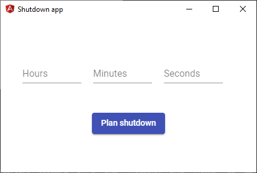

[![Build Status][build-badge]][build]
[![Make a pull request][prs-badge]][prs]
[![License: MIT][license-badge]](https://opensource.org/licenses/MIT)

# Introduction

A small application to schedule your next shutdown. 
It is build with Angular, Angular Material and Electron. 

## Credits

The initial setup was done with the awesome project https://github.com/maximegris/angular-electron

[build-badge]: https://dev.azure.com/steffenkoehler92/electron-shutdown/_apis/build/status/SteffenKoehler.electron-shutdown?branchName=master

[build]: https://dev.azure.com/steffenkoehler92/electron-shutdown/_apis/build/status/SteffenKoehler.electron-shutdown?branchName=master

[prs-badge]: https://img.shields.io/badge/PRs-welcome-brightgreen.svg?style=flat-square
[prs]: http://makeapullrequest.com

[license-badge]: https://img.shields.io/badge/License-MIT-success.svg
